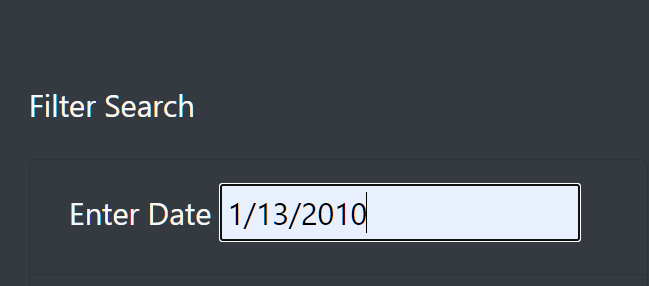
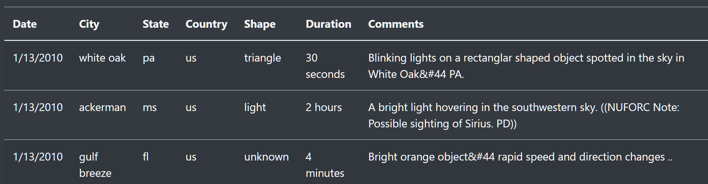
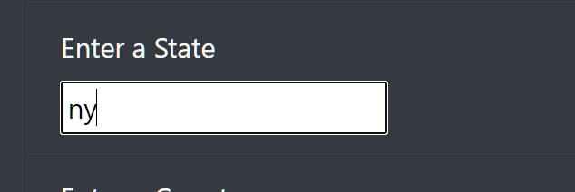
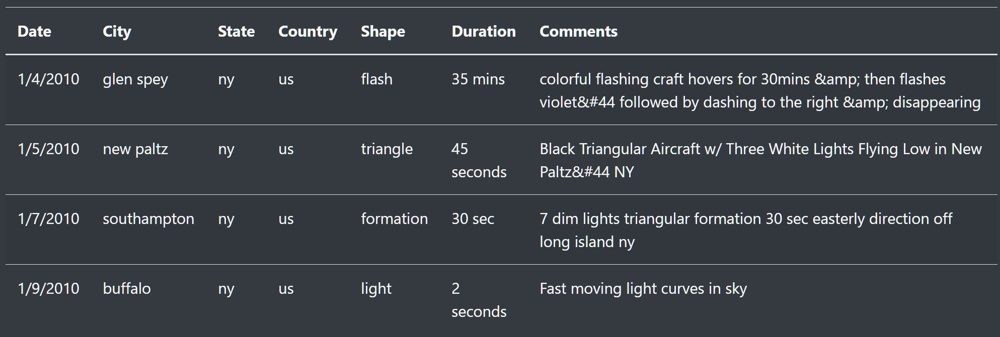

# UFOs
###

Overview:

The purpose of this analysis was to add more filters to the dynamic table of the UFO sightings webpage.
The purpose of adding more filters was for users to recieve more information upon entering multiple criterias about UfO sightings. The filters added were: city, state, country, and shape. 

#

Results: 

Once filters were added to the webpage, users now have the option of entering the search criteria of the date, city, state, country, and/or shape. When the webpage is loaded there are default search values. To filter the results the user can change one, some or all of the search criteria. Here are two examples on how to perform a search. 

- Lets change the date from the default value to 1/13/2010 in the 'Enter Date' text input, as shown below:

   

    

- The search results for the date entered are returned as shown below:

 
- To search for the state, user enters the abbreviation of the state as shown below: 
  
    

- The search results are returned for sightings of the state searched as shown below:

#
Summary:

In summary, this dynamic table executes returned results by one, some, or all of the searched criterias. There are drawbacks and improvements to address for an enhanced search experience. 

For example: 

- One drawback is the text input for all searches are case sensitive and should be entered only in lower case letters. 

  - The improvement for this drawback would be to enter various values for each search in the html code, so the user may have a variety of ways to enter text. For example, the State can be entered as an abbreviation (upper or lower case), and a whole word spelling of a state.

- A recommendation for the results returned from a search, would be to have a message sent back if no record of data is found for a give search criteria. 
 
- Another recommendation could be to improve the search for the shape criteria. When hovering over the search input box, a pop up text box with shape options can be added.